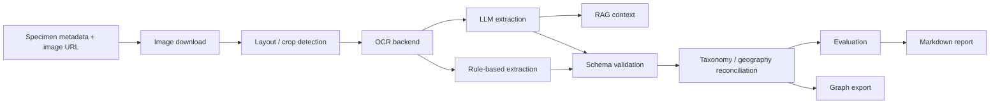

# Herbarium SCRIBE Demo

This repository is a small, runnable Document AI pipeline for herbarium specimen records. It was built as a SCRIBE-style demo for natural history collection records: starting from specimen metadata and label text or image URLs, it produces validated structured records, basic reconciliation fields, evaluation tables, a graph export, and a short report.

The default path is deliberately lightweight. It does not require PaddleOCR, Qwen, paid APIs, internet access, or large model files. The quick demo runs on fixture records with Tesseract-style OCR fallback and deterministic rule-based extraction. Optional LLM and authority backends are separated behind configuration flags.

## Why this is relevant to SCRIBE

SCRIBE is concerned with turning mixed collection evidence into structured, validated, reusable collection data. This project mirrors that workflow at a small scale: it separates raw metadata, image/layout/OCR stages, extraction, schema validation, reconciliation, evaluation, and graph export. The code is modular so that stronger OCR models, local LLMs, external taxonomic services, or production storage can be added without changing the whole pipeline.

## Pipeline



## Quick start

```bash
python -m pip install -e .
python scripts/run_pipeline.py --config configs/demo_10.yaml
```

The quick demo writes outputs under `data/processed/`, `data/interim/`, and `reports/`.

For tests:

```bash
pytest
```

Or use the Makefile:

```bash
make install
make test
make demo
```

## Cloud demo artifacts

GitHub Actions runs the same quick demo on an Ubuntu runner whenever `main` is pushed, on pull requests, or when the `demo artifacts` workflow is started manually. The workflow installs the package, runs `pytest`, runs:

```bash
python scripts/run_pipeline.py --config configs/demo_10.yaml
```

It uploads the generated `data/processed/`, `data/interim/ocr/`, `data/interim/llm/`, and `reports/` directories as a downloadable workflow artifact. Generated outputs are intentionally not committed to the repository.

The same workflow also has a DeepSeek v4 Pro + RAG artifact job through NVIDIA NIM. To enable it, add a repository Actions secret named `NVIDIA_API_KEY` or `NGC_API_KEY`, then re-run the workflow. The job runs:

```bash
python scripts/run_pipeline.py --config configs/deepseek_rag_demo.yaml
```

The DeepSeek job writes `nvidia_api_rag` rows into `data/processed/extractions_flat.csv`, saves raw model responses in `data/interim/llm/raw_llm_outputs.jsonl`, saves retrieved RAG context in `data/interim/llm/rag_contexts.jsonl`, and uploads those files in the `herbarium-scribe-deepseek-rag-*` artifact. The call uses NVIDIA's OpenAI-compatible endpoint, `https://integrate.api.nvidia.com/v1`, with model `deepseek-ai/deepseek-v4-pro`.

## Running the 50-record evaluation

```bash
python scripts/run_pipeline.py --config configs/eval_50.yaml
```

The default repository includes only a small fixture dataset, so `eval_50.yaml` will use as many fixture records as are available unless you point `metadata.input_csv` to a larger CSV. The sampler never uses `head(N)`; it uses a fixed random seed and stratified random sampling by `institutionCode` where possible.

## OCR fallback design

The OCR backend is configured with:

```yaml
ocr:
  backend: tesseract   # tesseract, paddle, auto
```

`auto` tries PaddleOCR only when it is installed. If PaddleOCR cannot be imported or fails at runtime, the pipeline logs the failure and continues with Tesseract. If neither an image OCR engine nor an image is available, fixture label text can be used in the demo so the pipeline stays runnable.

OCR outputs are saved per region under `data/interim/ocr/`, and the combined OCR table records engine, region, confidence when available, and text length.

## LLM backend design

The extraction interface is:

```python
call_llm(messages, config) -> str
```

Supported configured backends are:

- `none`: no LLM; rule-based extraction only. This is the default.
- `nvidia_api`: optional NVIDIA NIM API backend using `NVIDIA_API_KEY` or `NGC_API_KEY`; the DeepSeek demo uses `deepseek-ai/deepseek-v4-pro`.
- `qwen_api`: optional Qwen API backend using `DASHSCOPE_API_KEY` or `QWEN_API_KEY`.
- `qwen_local`: optional local Qwen-style inference. Missing packages or memory failures are logged and converted into an empty response.
- `anthropic`: optional API backend, key from `ANTHROPIC_API_KEY`.
- `openai`: optional API backend, key from `OPENAI_API_KEY`.

No API keys are stored in code. Raw LLM outputs are written as JSONL under `data/interim/llm/` when an LLM backend is used.

## RAG

`src/herbarium_scribe/rag.py` builds a lightweight corpus from field guide text and demo examples. It supports simple lexical retrieval by default, avoiding large embedding downloads. Optional external authority rows can be added from cached files.

The split code keeps `DEMO_SET` and `EVAL_SET` separate to avoid leakage from few-shot examples into evaluation records.

## Reconciliation

`reconcile.py` keeps verbatim extracted fields and adds derived fields such as:

- `scientificName_verbatim`
- `scientificName_canonical`
- `taxonomy_match_status`
- `taxonomy_warning`
- normalised country and state/province fields where possible

The default uses local string rules and cached tables when present. It does not silently overwrite the original extraction.

## Evaluation metrics

The evaluation module reports field-level exact match, token F1, prediction coverage, parse failure rate when an LLM is used, validation warning rate, OCR evidence proxy score, and stratified summaries by OCR quality tertile.

The OCR evidence proxy is not character error rate (CER) or word error rate (WER). Catalogue metadata is not a full label transcription, so this proxy only measures whether catalogue field values appear in OCR text after normalisation.

## Main limitations

The fixture dataset is small and hand-written, so it only checks that the pipeline is complete and defensible. It does not estimate real-world SCRIBE performance. The default OCR path can run without real OCR if no image engine is installed, which is useful for testing but should not be presented as production OCR accuracy. The optional Qwen, PaddleOCR, GBIF, and GeoNames paths are intentionally separated because they may need more memory, installed binaries, internet access, or service-specific rate handling.

## Next steps toward production

A production version would add stronger image layout detection trained on herbarium sheets, measured OCR against true label transcriptions, larger and versioned authority caches, human review queues for low-confidence fields, persistent storage, provenance links back to image regions, and monitoring of institution-specific failure modes.
